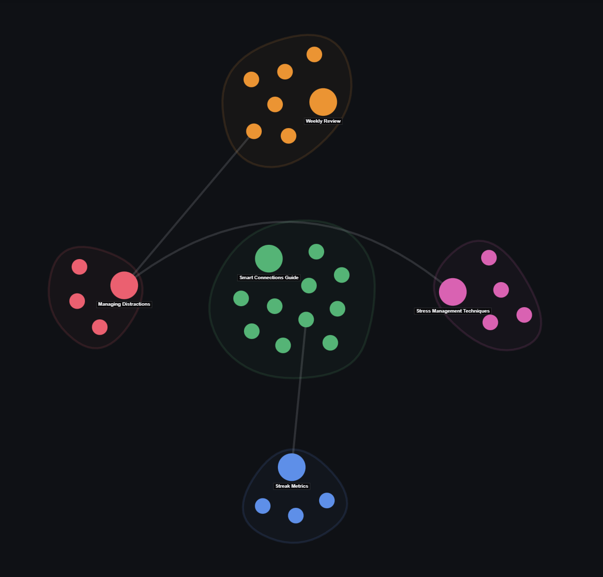

# Smart Cluster Graph

A powerful, aesthetic cluster graph explorer for **Obsidian**. It automatically partitions your vault notes into distinct folder-based community clusters, renders tight soft convex hulls, and displays a clean knowledge skeleton powered by **Strongest Bridge Links** and **Line Crossing Avoidance**.

---

## ✨ Key Features

- 🏝️ **Folder-Based Community Clusters**: Partitions notes into distinct, vibrant topic clusters with zero overlapping bubble clutter.
- 🌉 **Strongest Bridge Architecture (Cluster Skeleton)**: Completely hides internal node web clutter, rendering only the single strongest bridge edge between cluster pairs (capped at max 2 links per cluster).
- ↪️ **Line Crossing Avoidance**: Smart curved routing algorithm that smoothly bends cross-cluster bridge lines around intermediate cluster hulls.
- 🎨 **Tight Soft Convex Hulls**: Encloses all nodes and selection rings in tight, beautiful semi-transparent polygon/capsule envelopes with zero edge overflow.
- 🎯 **Active Note Highlighting**: Automatically synchronizes with your currently open Obsidian note, marking it with a crisp white selection ring.
- 🖱️ **Intuitive Panning & Centered Zooming**: Supports smooth left-click canvas panning and screen-center wheel zooming without unwanted camera jumps.
- ⚙️ **Customizable Zoom & Opacity**: Manually adjust your default initial zoom scale (`1.0x` to `6.0x`) and hull transparency directly from settings.

---

## 🚀 Installation

### Option 1: Obsidian Community Plugin Store (Recommended)
1. Open Obsidian **Settings** -> **Community plugins**.
2. Turn off **Restricted mode**.
3. Click **Browse** and search for `Smart Cluster Graph`.
4. Click **Install**, then **Enable**.

### Option 2: Manual Installation
1. Download `main.js`, `manifest.json`, and `styles.css` from the latest [GitHub Release](https://github.com/comedianhhh/obsidian-smart-cluster-graph/releases).
2. Create a folder named `smart-cluster-graph` under your vault's `.obsidian/plugins/` directory.
3. Copy the downloaded files into `.obsidian/plugins/smart-cluster-graph/`.
4. Reload Obsidian and enable **Smart Cluster Graph** under Community plugins.

---

## 🕹️ Controls & Navigation

| Action | Control | Description |
| :--- | :--- | :--- |
| **Select Node** | Single Left-Click | Marks node with a tight white ring (does NOT shift camera). |
| **Open Note** | Double Left-Click | Opens the corresponding Markdown document in Obsidian. |
| **Pan Canvas** | Left-Click Drag | Smoothly translates the graph viewport. |
| **Zoom In/Out** | Scroll Wheel | Zooms in/out centered around the screen center. |
| **Context Menu** | Right-Click Node | Access focus, pin, hide, and open in new tab options. |

---

## ⚙️ Settings

- **Default Initial Zoom Scale**: Manually set default camera zoom level on startup (`1.0x` to `6.0x`).
- **Follow Active Note**: Automatically highlight currently active editor tab in the graph.
- **Focus Similarity Threshold**: Adjust vector similarity threshold (`0.30` to `0.85`) for semantic relations.
- **Cluster Polygon Hull Opacity**: Adjust fill transparency for semi-transparent cluster envelopes.

---

## 📄 License

Distributed under the [MIT License](LICENSE).
